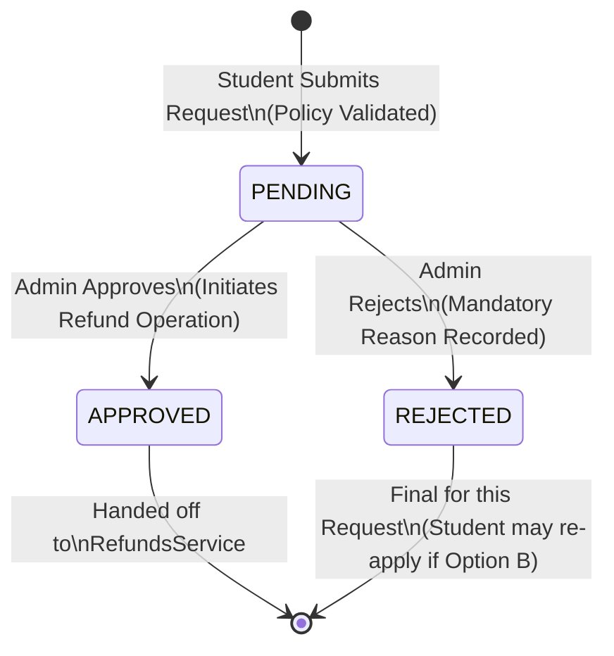
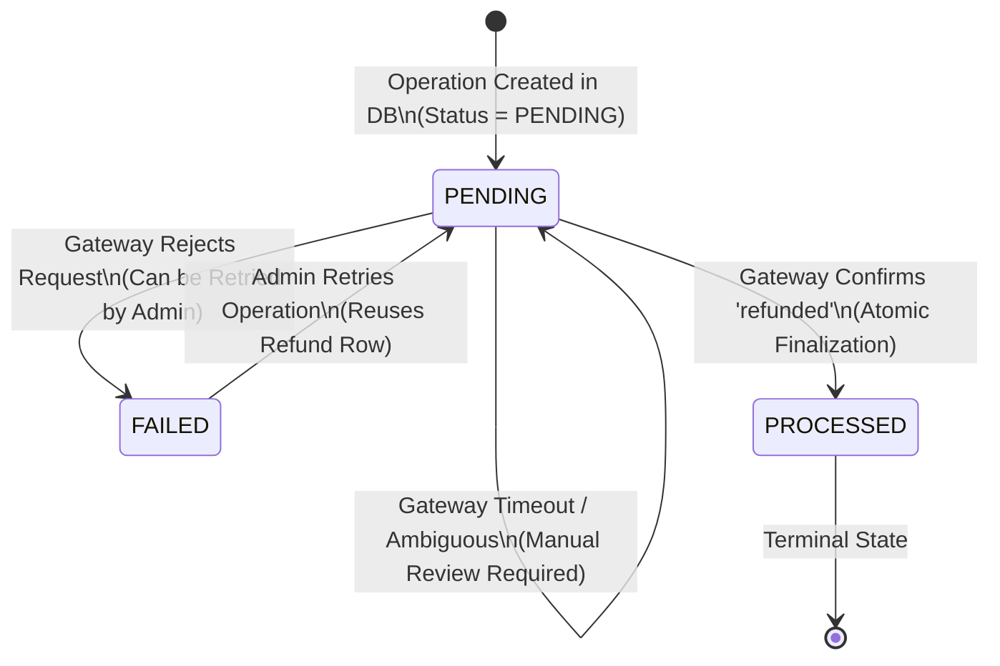
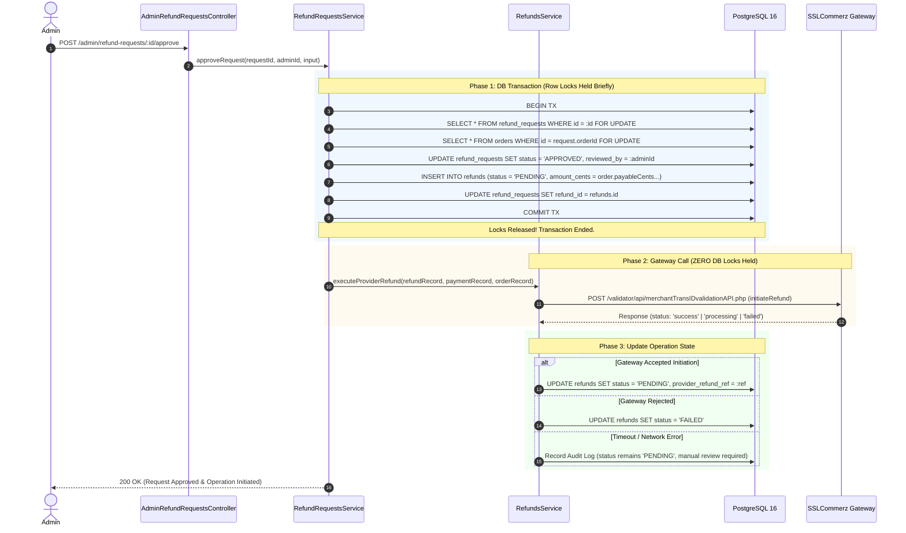

# TechSprout — P5.5 Architecture Specification & Final Freeze
## Document Status: ARCHITECTURE REVIEW COMPLETE — PENDING PRODUCT DECISION APPROVAL

---

## 1. Document Status
- **Document Identifier**: `TECHSPROUT-ARCH-P5.5-FREEZE`
- **Revision**: `1.0.0`
- **Author**: Senior Software Architect, Backend Architect, Payments Engineer, Security Lead
- **Target Subsystem**: Student Orders & Self-Service Refunds, Admin Refund Queue, Invoice PDF, Financial Reporting
- **Current Status**: **ARCHITECTURE REVIEW COMPLETE — PENDING PRODUCT DECISION SIGN-OFF**
- **Implementation Status**: **NOT STARTED — STRICT IMPLEMENTATION FREEZE IN EFFECT**

---

## 2. P5 Frozen Baseline
- **Git Commit Baseline**: `142866cdb900ba763597caff4ef4e9c43e858189`
- **Git Branch**: `feat/p1-foundation-security`
- **Baseline Verification**:
  - Automated Regression Tests: **958 / 958 passing** (0 regressions, 0 warnings, 0 type errors).
  - Production Builds: `build:api` and `build:web` clean.
  - Remote Staging Deployment:
    - Backend: `https://techsprout-api.onrender.com/api/v1` (Healthy, PostgreSQL 16 & Redis connected).
    - Frontend: `https://techsprout-git-feat-p1-foundation-security-tech-sprout.vercel.app` (Live).
    - Gateway: SSLCommerz Sandbox live merchant integration active.
    - End-to-End Payment: Authoritative server validation verified (`Order -> PAID`, `Payment -> VALIDATED`, `Enrollment -> ACTIVE`, `Invoice -> PAID`).
    - Failure/Cancellation: Safe recovery verified (no orphaned enrollments or invoices).
    - Currency Formatting: Universal standard `BDT` formatting verified across all customer-facing surfaces.

---

## 3. P5.5 Objective
The primary objective of milestone P5.5 is to complete the commercial operational lifecycle of TechSprout by delivering:
1. **Student Self-Service Transparency**: Providing students with a dedicated Order History interface, transparent access to their historical purchases and invoices, and a policy-bounded workflow to request refunds.
2. **Operational Administration**: Equipping platform administrators with a dedicated Refund Request Review Queue to adjudicate student refund applications with complete visibility into student progress and payment history.
3. **Decoupled Financial Execution**: Reconciling student refund requests with the frozen P5 authoritative two-phase refund engine without exposing database locks to external network latency.
4. **Document Portability & Compliance**: Offering deterministic, server-generated PDF invoices for student record-keeping and administrative auditing.
5. **Institutional Reporting**: Enabling high-throughput, memory-efficient streaming CSV exports of financial transactions for external accounting and reconciliation.

---

## 4. In Scope
1. **Student Order History UI & Navigation**:
   - Web view at `/orders` listing all historical orders for the authenticated student.
   - Order detail view at `/orders/[orderId]` with line-item breakdown, discount transparency, invoice links, and refund status indicators.
2. **Student Refund Request Workflow**:
   - Modal/drawer on eligible paid orders to submit a formal refund request.
   - Server-authoritative eligibility evaluation at time of submission.
   - Dedicated table `refund_requests` tracking application lifecycle.
3. **Admin Refund Review Queue**:
   - New admin interface tab at `/admin/finance/refund-requests` within `FinanceSubNav`.
   - List view with filtering by request status (`PENDING`, `APPROVED`, `REJECTED`), student email, and date.
   - Detail modal showing course progress snapshot, purchase date, student reason, and admin action buttons.
4. **Integration with Existing P5 Authoritative Refund Engine**:
   - Admin approval initiates payment gateway refund via existing `RefundsService.initiateOrRetryRefund`.
   - Complete preservation of P5 two-phase execution and asynchronous reconciliation.
5. **Downloadable PDF Invoices**:
   - Endpoint `GET /api/v1/invoices/:id/pdf` returning binary PDF stream.
   - Ownership and RBAC authorization preventing IDOR.
   - UI "Download PDF" button on `/invoices/[id]`.
6. **Financial CSV Export**:
   - Endpoint `GET /api/v1/admin/finance/export` streaming CSV files for orders, refunds, and invoices.
   - Date range filtering, BOM encoding for Excel compatibility, and strict RFC 4180 escaping.
   - UI "Export CSV" trigger in `/admin/finance`.

---

## 5. Out of Scope
1. **Multi-Currency & FX Processing**: Only `BDT` is supported. Multi-currency conversions remain deferred.
2. **Partial Refunds**: All refunds remain full-order cancellations. Partial line-item or prorated refunds are strictly deferred.
3. **Automated Refund Execution on Submission**: Students cannot trigger immediate gateway refunds. All student submissions require human administrator review.
4. **Automatic Coupon Re-crediting**: Consumed coupon redemptions remain consumed upon refund. No automated replenishment of promo codes or voucher credits.
5. **Recurring Billing & Subscriptions**: Only one-time course purchases are supported.
6. **Third-Party ERP / Accounting Synchronizations**: No direct webhook feeds to SAP, QuickBooks, or Xero. Exports occur via CSV.
7. **AI / Automated Dispute Adjudication**: No LLM-driven decisioning on refund legitimacy.

---

## 6. Existing P5 Capabilities Reused
The P5.5 architecture is designed to maximize reuse of battle-tested P5 primitives:
1. **Authoritative Refund Engine (`RefundsService`)**:
   - `initiateOrRetryRefund`: Two-phase transaction structure where database locks are committed before making external SSLCommerz HTTP calls.
   - `queryRefundStatus`: Asynchronous polling of SSLCommerz refund status (`processing`, `refunded`, `failed`).
   - `atomicFinalizeRefund`: Idempotent domain finalization that atomically sets `Order -> REFUNDED`, `Invoice -> REFUNDED`, `Enrollment -> CANCELLED`, and `Certificate -> REVOKED`.
   - `reconcileRefund`: Manual admin override for ambiguous gateway states.
2. **Direct Admin Refund Capabilities (`AdminOrdersRefundController`)**:
   - `POST /api/v1/admin/orders/:id/refund` remains intact for direct administrative overrides without requiring a student-initiated ticket.
3. **Student Order Query Service (`OrdersService.listStudentOrders`)**:
   - `GET /api/v1/orders` already implements server-side filtering by `studentId = req.user.id` with stable pagination and sorting.
4. **Learning & Progress Verification (`LearningService.calculateProgress`)**:
   - Server-side calculation of completed lessons vs total curriculum lessons to verify refund eligibility.
5. **Audit Subsystem (`AuditService`)**:
   - Central logging via `audit_logs` table storing actor, action, target entity, request correlation IDs, and non-sensitive metadata.
6. **Money Formatting Primitives (`formatMinorUnits`)**:
   - Shared client utility rendering minor units to standardized `BDT #,##0.00` representation.

---

## 7. Current-State Gaps
1. **Missing Persistence Entity**: No table exists to store student refund applications, reasons, review states, reviewer identity, or review timestamps.
2. **Missing Frontend Routes**:
   - `apps/web/src/app/orders/page.tsx` (Student Order History) does not exist.
   - `apps/web/src/app/orders/[orderId]/page.tsx` (Student Order Details) does not exist.
   - `apps/web/src/app/admin/finance/refund-requests/page.tsx` (Admin Review Queue) does not exist.
3. **Missing PDF Invoice Generation**: Invoices can only be viewed in HTML or printed via browser `window.print()`. No binary PDF endpoint exists.
4. **Missing Export Endpoint**: Admin finance dashboard displays summary metrics and reconciliation tables, but cannot export raw transaction logs to CSV.
5. **Contract Definitions**: `@techsprout/contracts` lacks schemas for `RefundRequestDto`, `CreateRefundRequestDto`, `AdminReviewRefundRequestDto`, and `FinanceExportQuery`.

---

## 8. Product Decisions Required
Before code implementation commences, platform leadership must formally approve the following business parameters. These must **NOT** be assumed by engineering:

| # | Decision Item | Context | Impacted Component |
|---|---|---|---|
| **PD-1** | **Refund Policy Time Window** | Number of calendar days or hours post-purchase during which a student may submit a refund request. | `RefundRequestsService.evaluateEligibility` |
| **PD-2** | **Course Progress Threshold** | Maximum percentage of curriculum progress allowed before refund eligibility is revoked. | `RefundRequestsService.evaluateEligibility` |
| **PD-3** | **Multiple Request Policy** | Whether a student whose request is `REJECTED` may re-apply within the valid time window, or if rejection is final. | Database constraint on `refund_requests` |
| **PD-4** | **Tax / VAT Representation** | Whether invoice PDFs must display a discrete VAT breakdown (e.g. 5% or 15%) or if TechSprout prices are VAT-inclusive/exempt. | `InvoicePdfService` & PDF layout |
| **PD-5** | **Certificate Pre-existence Action** | If an administrative override issues a refund on a completed course where a certificate was issued, confirm that certificate status `REVOKED` is acceptable without blocking the refund. | `RefundsService.atomicFinalizeRefund` |

---

## 9. Recommended Product Defaults
To facilitate rapid stakeholder review, engineering recommends the following baseline defaults:

1. **Refund Policy Window (PD-1)**:
   - **Recommended Default**: **7 Calendar Days (168 Hours)** calculated from `order.paidAt` in authoritative UTC.
   - *Rationale*: Standard in regional e-learning; aligns with digital goods consumer protection norms while preventing content scraping.
2. **Course Progress Threshold (PD-2)**:
   - **Recommended Default**: **Strictly less than 20% (< 20%)** course progress, with 0 completed quizzes.
   - *Rationale*: 20% allows students to inspect introductory modules without consuming core intellectual property.
3. **Multiple Request Policy (PD-3)**:
   - **Recommended Default**: **Option B (Only One Active Request at a Time)**.
   - *Behavior*: If a request is `REJECTED` (e.g., submitted under the wrong category or with incomplete details), the student may submit a revised request provided the order remains within the 7-day window and < 20% progress. Once a refund is `PROCESSED`, the order is `REFUNDED` and all future requests are permanently blocked.
4. **Tax / VAT Representation (PD-4)**:
   - **Recommended Default**: **TAX/VAT BREAKDOWN REQUIRES PRODUCT/ACCOUNTING DECISION**.
   - *Temporary Engineering Baseline*: Render invoices with existing snapshot data (`subtotalCents`, `discountCents`, `payableCents`) with a note: *"All prices are inclusive of applicable VAT/taxes under Bangladesh regulations"*. Do **not** inject synthetic tax calculations into the database.
5. **Certificate Interaction (PD-5)**:
   - **Recommended Default**: Self-service student refund requests are automatically blocked if course progress >= 20% (and certificates require 100% completion). For admin direct refunds, the existing behavior (`certificates.status = 'REVOKED'`) remains active.

---

## 10. Final Data Model
P5.5 introduces a single additive table: `refund_requests`. No existing tables or columns are modified or removed.

### Enums
```sql
CREATE TYPE "refund_request_status" AS ENUM ('PENDING', 'APPROVED', 'REJECTED');

CREATE TYPE "refund_request_reason_category" AS ENUM (
  'COURSE_CONTENT_MISMATCH',
  'TECHNICAL_ISSUES',
  'ACCIDENTAL_PURCHASE',
  'PERSONAL_REASONS',
  'OTHER'
);
```

### Table Definition: `refund_requests`
```sql
CREATE TABLE "refund_requests" (
  "id" uuid PRIMARY KEY DEFAULT gen_random_uuid(),
  "request_number" varchar(50) NOT NULL,
  "order_id" uuid NOT NULL REFERENCES "orders"("id") ON DELETE restrict,
  "student_id" uuid NOT NULL REFERENCES "users"("id") ON DELETE restrict,
  "course_id" uuid NOT NULL REFERENCES "courses"("id") ON DELETE restrict,
  "enrollment_id" uuid NOT NULL REFERENCES "enrollments"("id") ON DELETE restrict,
  "reason_category" "refund_request_reason_category" NOT NULL,
  "reason_detail" text NOT NULL,
  "course_progress_at_request" integer NOT NULL,
  "status" "refund_request_status" DEFAULT 'PENDING' NOT NULL,
  "reviewed_by" uuid REFERENCES "users"("id") ON DELETE restrict,
  "reviewed_at" timestamp with time zone,
  "rejection_reason" text,
  "admin_notes" text,
  "refund_id" uuid REFERENCES "refunds"("id") ON DELETE restrict,
  "created_at" timestamp with time zone DEFAULT now() NOT NULL,
  "updated_at" timestamp with time zone DEFAULT now() NOT NULL,
  CONSTRAINT "refund_requests_progress_range" CHECK ("course_progress_at_request" >= 0 AND "course_progress_at_request" <= 100),
  CONSTRAINT "refund_requests_reason_detail_min_len" CHECK (length(trim("reason_detail")) >= 10)
);
```

### Indexes & Uniqueness Constraints
1. **Request Number Uniqueness**:
   ```sql
   CREATE UNIQUE INDEX "refund_requests_request_number_uq" ON "refund_requests" ("request_number");
   ```
2. **Active Request Constraint (Option B)**:
   Enforces that an order can have at most one pending or approved request active simultaneously:
   ```sql
   CREATE UNIQUE INDEX "refund_requests_active_order_uq" ON "refund_requests" ("order_id")
   WHERE "status" IN ('PENDING', 'APPROVED');
   ```
3. **Performance Query Indexes**:
   ```sql
   CREATE INDEX "refund_requests_student_id_idx" ON "refund_requests" ("student_id");
   CREATE INDEX "refund_requests_status_idx" ON "refund_requests" ("status");
   CREATE INDEX "refund_requests_created_at_idx" ON "refund_requests" ("created_at");
   CREATE INDEX "refund_requests_reviewed_by_idx" ON "refund_requests" ("reviewed_by");
   ```

---

## 11. Final API Contracts

### A. Student Refund Request Endpoints
1. **Check Refund Eligibility**:
   - `GET /api/v1/orders/:id/refund-eligibility`
   - **Auth**: Bearer Token or Cookie Session (Student owner).
   - **Response**:
     ```json
     {
       "success": true,
       "data": {
         "isEligible": true,
         "reason": null,
         "daysRemaining": 4,
         "courseProgressPercentage": 12,
         "maxAllowedProgressPercentage": 20,
         "orderPaidAt": "2026-10-01T12:00:00.000Z",
         "payableCents": 100000,
         "currency": "BDT"
       }
     }
     ```
2. **Submit Refund Request**:
   - `POST /api/v1/orders/:id/refund-request`
   - **Auth**: Bearer Token or Cookie Session (Student owner).
   - **Request Body**:
     ```json
     {
       "reasonCategory": "COURSE_CONTENT_MISMATCH",
       "reasonDetail": "The course curriculum covers different frameworks than advertised in the syllabus overview."
     }
     ```
   - **Response (201 Created)**:
     ```json
     {
       "success": true,
       "message": "Refund request submitted successfully and is pending administrator review.",
       "data": {
         "id": "c1f7b0a2-...",
         "requestNumber": "TSP-REQ-2026-9A7B3C",
         "orderId": "d742e28d-...",
         "status": "PENDING",
         "courseProgressAtRequest": 12,
         "createdAt": "2026-10-05T13:00:00.000Z"
       }
     }
     ```

### B. Admin Refund Request Queue Endpoints
1. **List Refund Requests**:
   - `GET /api/v1/admin/refund-requests`
   - **Auth**: Admin only (`@Roles('admin')`).
   - **Query Parameters**: `page`, `limit`, `status`, `search` (student name/email/order number), `startDate`, `endDate`.
   - **Response (200 OK)**: Paginated `RefundRequestListItemDto` objects.
2. **Get Refund Request Details**:
   - `GET /api/v1/admin/refund-requests/:id`
   - **Auth**: Admin only.
   - **Response (200 OK)**: Full detail including student profile, order breakdown, payment transaction details, and current progress.
3. **Approve Refund Request**:
   - `POST /api/v1/admin/refund-requests/:id/approve`
   - **Auth**: Admin only.
   - **Request Body**:
     ```json
     {
       "adminNotes": "Student contacted within policy window; syllabus mismatch verified."
     }
     ```
   - **Response (200 OK)**: Returns updated `refund_requests` row (`status: 'APPROVED'`) and linked `refunds` operation row (`status: 'PENDING'`).
4. **Reject Refund Request**:
   - `POST /api/v1/admin/refund-requests/:id/reject`
   - **Auth**: Admin only.
   - **Request Body**:
     ```json
     {
       "rejectionReason": "Course progress recorded prior to request exceeded maximum threshold.",
       "adminNotes": "Progress log indicates 45% completion."
     }
     ```
   - **Response (200 OK)**: Returns updated `refund_requests` row (`status: 'REJECTED'`).

### C. Invoice PDF Endpoint
- `GET /api/v1/invoices/:id/pdf`
- **Auth**: Authenticated student owning `invoice.studentId` OR Admin.
- **Headers Returned**:
  - `Content-Type: application/pdf`
  - `Content-Disposition: attachment; filename="Invoice-TSP-INV-2026-472464576.pdf"`
  - `Cache-Control: private, no-cache, no-store, must-revalidate`

### D. Financial CSV Export Endpoint
- `GET /api/v1/admin/finance/export`
- **Auth**: Admin only.
- **Query Parameters**:
  - `type`: `'orders' | 'refunds' | 'invoices'` (required)
  - `startDate`: ISO 8601 string (optional)
  - `endDate`: ISO 8601 string (optional)
  - `status`: string filter (optional)
- **Headers Returned**:
  - `Content-Type: text/csv; charset=utf-8`
  - `Content-Disposition: attachment; filename="techsprout-finance-orders-20261005.csv"`

---

## 12. Student UI Architecture
1. **Route `/orders` (Student Order History)**:
   - Built under `apps/web/src/app/orders/page.tsx`.
   - Uses `fetchStudentOrders` querying `GET /api/v1/orders`.
   - Displays orders table/card layout with:
     - Order Number (`TSP-ORD-...`) & Date.
     - Course Title & Thumbnail.
     - Payable Amount (`BDT #,##0.00`).
     - Order Status Badge (`PAID`, `PENDING`, `REFUNDED`, `CANCELLED`).
     - Actions: "View Details", "Invoice", "Request Refund" (conditional).
2. **Route `/orders/[orderId]` (Order Details & Refund Entrypoint)**:
   - Displays itemized breakdown: Course, Subtotal, Discount/Coupon, Paid Total.
   - Payment details: Method, Bank Transaction ID, Date Paid.
   - Refund Application Section:
     - If Order is `PAID` and eligible: "Request Refund" button opens confirmation modal.
     - If a request is `PENDING`: Info alert showing "Refund request submitted on [Date] — Under administrative review".
     - If a request was `APPROVED`: Info alert showing "Refund approved — Processing with payment gateway".
     - If a request was `REJECTED`: Alert showing "Refund request declined on [Date]. Reason: [rejectionReason]".
     - If Order is `REFUNDED`: Badge showing "Order Refunded on [Date]".
3. **Refund Request Modal**:
   - Client-side checks eligibility via `/refund-eligibility`.
   - Dropdown for `reasonCategory`.
   - Textarea for `reasonDetail` (min 10 chars).
   - Warning banner: *"Submitting this request will result in immediate loss of course access upon approval."*

---

## 13. Admin UI Architecture
1. **Navigation Extension**:
   - Update `apps/web/src/components/admin/FinanceSubNav.tsx` to add a 4th tab:
     - Title: `'Refund Requests'`
     - Href: `'/admin/finance/refund-requests'`
     - Icon: `ClipboardCheck`
2. **Route `/admin/finance/refund-requests` (Admin Review Queue)**:
   - Filter bar: Status tabs (`PENDING`, `APPROVED`, `REJECTED`, `ALL`), search input, date range picker.
   - Queue table: Request #, Student Name & Email, Course Title, Progress At Request, Order Date, Amount, Status, Actions.
   - Action Modal / Slide-over:
     - Full order summary & student learning activity.
     - "Approve Refund" button (triggers two-phase gateway refund).
     - "Reject Refund" button (requires entering mandatory rejection reason).
3. **Invoice Detail Page Enhancement (`/invoices/[id]`)**:
   - Add "Download PDF" button next to existing "Print Invoice" button.
4. **Finance Dashboard Enhancement (`/admin/finance`)**:
   - Add "Export Financial Data" button opening an export drawer to select entity type (`Orders`, `Refunds`, `Invoices`) and date range.

---

## 14. Refund Request State Machine
The student refund request entity (`refund_requests`) operates on a strictly separated state machine:



- **Transitions**:
  - `SUBMIT`: `[*] -> PENDING` (Validated by ownership, 7-day window, < 20% progress, order `PAID`).
  - `APPROVE`: `PENDING -> APPROVED` (Admin action only; initiates external refund operation).
  - `REJECT`: `PENDING -> REJECTED` (Admin action only; requires `rejectionReason`).
  - **Forbidden Transitions**:
    - `APPROVED -> PENDING` (Forbidden).
    - `REJECTED -> PENDING` (Forbidden).
    - `REJECTED -> APPROVED` (Forbidden).

---

## 15. Refund Operation State Machine (P5 Baseline Reused)
The gateway-level refund operation (`refunds` table) remains identical to the frozen P5 model:



- **Transitions**:
  - `INITIATE`: `[*] -> PENDING` (Row inserted inside short DB transaction).
  - `GATEWAY_SUBMIT`: Performed outside DB locks. If gateway returns `success`/`processing`, updates `providerRefundRef`.
  - `GATEWAY_REJECT`: Gateway explicitly denies refund; status becomes `FAILED`.
  - `GATEWAY_TIMEOUT`: Gateway network drops; status remains `PENDING` (no retry initiated).
  - `QUERY_SETTLED`: Gateway query confirms refund; status becomes `PROCESSED`.

---

## 16. Consolidated Entity State Matrix

| Order Status | Payment Status | Refund Request Status | Refund Operation Status | Invoice Status | Enrollment Status | System Interpretation |
|---|---|---|---|---|---|---|
| `PAID` | `VALIDATED` | *(none)* | *(none)* | `PAID` | `ACTIVE` | Normal enrolled student; eligible to apply for refund. |
| `PAID` | `VALIDATED` | `PENDING` | *(none)* | `PAID` | `ACTIVE` | Student requested refund; awaiting admin review. Course access remains active. |
| `PAID` | `VALIDATED` | `REJECTED` | *(none)* | `PAID` | `ACTIVE` | Admin rejected refund request. Course access remains active. |
| `PAID` | `VALIDATED` | `APPROVED` | `PENDING` | `PAID` | `ACTIVE` | Admin approved; refund initiated with SSLCommerz, awaiting confirmation. |
| `PAID` | `VALIDATED` | `APPROVED` | `FAILED` | `PAID` | `ACTIVE` | Gateway rejected refund operation. Admin must retry or reconcile. |
| `REFUNDED` | `VALIDATED` | `APPROVED` | `PROCESSED` | `REFUNDED` | `CANCELLED` | Authoritative settlement complete. Order, invoice, and enrollment finalized. |
| `REFUNDED` | `VALIDATED` | *(none)* | `PROCESSED` | `REFUNDED` | `CANCELLED` | Direct admin refund executed without student request. |

### Critical Invariants
1. `order.status` moves to `REFUNDED` **ONLY** when `refund.status === 'PROCESSED'`.
2. Admin clicking "Approve" **NEVER** directly marks `order.status = 'REFUNDED'`.
3. `enrollments.status` moves to `CANCELLED` **ONLY** upon authoritative refund confirmation (`PROCESSED`).
4. `invoices.status` moves to `REFUNDED` **ONLY** upon authoritative refund confirmation (`PROCESSED`).
5. `invoices` financial snapshot values (`subtotalCents`, `discountCents`, `payableCents`, `bankTranId`) are **NEVER** modified.

---

## 17. Refund Execution Sequence (Two-Phase Approval)
This sequence eliminates database lock holding during external HTTP calls:



---

## 18. External Gateway Interaction Rules
1. **Zero Lock Rule**: Under **no circumstances** may an active PostgreSQL transaction, row-level lock (`FOR UPDATE`), or table lock remain open while calling SSLCommerz APIs (`initiateRefund` or `queryRefund`).
2. **Deterministic Correlation ID**: The refund transaction identifier (`refund_trans_id`) sent to SSLCommerz must strictly match `refunds.refundNumber` (`TSP-REF-...`).
3. **No Blind Retries**: If SSLCommerz times out or returns an HTTP 504/socket hang-up, the system **MUST NOT** automatically re-issue a second `initiateRefund` request. The refund remains in `PENDING` state with `providerRefundRef: null` until resolved via administrative status query or manual reconciliation.
4. **Idempotency Protection**: SSLCommerz Sandbox does not guarantee provider-side deduplication. System-side deduplication is enforced by the unique constraint on `refunds.order_id` and the state machine preventing duplicate executions.

---

## 19. Transaction Boundaries
- **Submission Boundary**:
  - `POST /orders/:id/refund-request`:
    Single transaction reading `orders`, `order_items`, and `enrollments`, calling `LearningService.calculateProgress`, checking the active request unique constraint, and inserting `refund_requests`. (Duration: < 15ms).
- **Approval Boundary (Phase 1)**:
  - Updates `refund_requests` to `APPROVED`, inserts `refunds` row (`PENDING`). Commits immediately. (Duration: < 10ms).
- **Finalization Boundary (Phase 4)**:
  - Executed inside `atomicFinalizeRefund` when provider confirms settlement:
    Locks `orders`, `refunds`, `enrollments`, `invoices`, and `certificates` rows `FOR UPDATE`.
    Updates all 5 tables atomically. Commits immediately. (Duration: < 20ms).

---

## 20. Concurrency Rules & Race Condition Handling

| Concurrency Scenario | Potential Hazard | Architectural Mitigation | Outcome |
|---|---|---|---|
| **1. Student submits two refund requests simultaneously** | Duplicate pending requests for same order. | Partial Unique Index `refund_requests_active_order_uq` on `order_id` where `status IN ('PENDING', 'APPROVED')`. | First transaction succeeds; second transaction fails with HTTP 409 `REFUND_REQUEST_ALREADY_ACTIVE`. |
| **2. Student submits refund while Admin reviews order** | Stale request creation against mutating order. | `orders` row locked `FOR UPDATE` during request creation; verifies `order.status === 'PAID'`. | Consistent ordering; request accepted or rejected based on committed order state. |
| **3. Two admins click "Approve" simultaneously** | Double refund initiation with gateway. | `refund_requests` row locked `FOR UPDATE`. First admin changes status to `APPROVED`. Second admin transaction reads `status !== 'PENDING'`. | First admin proceeds; second admin receives HTTP 409 `REQUEST_ALREADY_REVIEWED`. |
| **4. Admin approves while another admin rejects** | Conflicting decisioning. | `refund_requests` row locked `FOR UPDATE`. First committed decision wins. | Second decision rejected with HTTP 409 `REQUEST_ALREADY_REVIEWED`. |
| **5. Direct admin refund and student approval occur simultaneously** | Two separate refund rows created for same order. | Unique constraint `refunds_order_id_uq` on `refunds.order_id`. | Exactly one `refunds` row can exist per order; second attempt fails with HTTP 409 `REFUND_ALREADY_PENDING`. |
| **6. Gateway timeout followed by status query** | Double settlement or lost state. | Timeout leaves refund `PENDING`. Status query checks SSLCommerz authoritative settlement before executing atomic finalization. | Idempotent; finalized exactly once. |
| **7. Student completes lessons while submitting request** | Progress race: student completes lesson, pushing progress over 20%. | Progress is calculated server-side inside the request transaction and stored as an immutable snapshot `course_progress_at_request`. | Evaluated authoritatively at submission instant. |
| **8. Order status changes during request submission** | Request submitted for already refunded or cancelled order. | `orders` row locked `FOR UPDATE`; verifies `status === 'PAID'`. | If order is not `PAID`, fails with HTTP 400 `ORDER_NOT_REFUNDABLE`. |

---

## 21. Idempotency Rules
1. **Student Request Submission**: Enforced by `orderId` unique partial index. Retried clicks return the existing request or HTTP 409.
2. **Admin Review Action**: Review endpoints check that `refund_requests.status === 'PENDING'`. Repeated submissions return HTTP 409.
3. **Gateway Finalization**: `RefundsService.atomicFinalizeRefund` checks `if (refund.status === 'PROCESSED' || order.status === 'REFUNDED') return formatRefundDto(refund)`. Multiple webhook callbacks or query calls return immediately without duplicate mutations.

---

## 22. Security, RBAC & IDOR Rules
1. **Student Order & Invoice Scoping**:
   - Every student query must explicitly include `where(eq(orders.studentId, req.user.id))`.
   - Never trust client-supplied student IDs or URLs.
2. **Invoice PDF Authorization**:
   - `GET /api/v1/invoices/:id/pdf` validates:
     - `if (req.user.role !== 'admin' && invoice.studentId !== req.user.id) throw new ApiException('Access denied', 403, 'INVOICE_ACCESS_DENIED')`.
3. **Admin Queue Authorization**:
   - All `/admin/refund-requests` routes protected by `@UseGuards(RolesGuard)` and `@Roles('admin')`.
4. **Rate Limiting**:
   - PDF download endpoint protected by `ThrottlerGuard` (limit: 10 requests / minute / user) to prevent DoS via CPU-intensive PDF rendering.
   - Refund request submission protected by `ThrottlerGuard` (limit: 5 submissions / hour / user).

---

## 23. Audit Logging
All P5.5 actions reuse the existing `audit_logs` table via `AuditService.record()`:

| Action Identifier | Actor | Target Type | Target ID | Logged Metadata (Secrets Excluded) |
|---|---|---|---|---|
| `REFUND_REQUEST_SUBMITTED` | Student | `refund_request` | `requestId` | `orderId`, `reasonCategory`, `progressPercentage` |
| `REFUND_REQUEST_APPROVED` | Admin | `refund_request` | `requestId` | `orderId`, `adminNotes`, `refundId` |
| `REFUND_REQUEST_REJECTED` | Admin | `refund_request` | `requestId` | `orderId`, `rejectionReason`, `adminNotes` |
| `INVOICE_PDF_DOWNLOADED` | Student/Admin | `invoice` | `invoiceId` | `invoiceNumber`, `ipAddress` |
| `FINANCE_CSV_EXPORTED` | Admin | `finance_export` | `exportType` | `recordCount`, `dateRange` |

---

## 24. Invoice PDF Architecture
1. **Library Selection**:
   - Recommended library: `pdfkit` (Node.js native streaming vector engine, ~1MB dependency, zero native binary compilation required).
2. **Generation Pipeline**:
   - Stream binary directly to HTTP response (`res.pipe()`). Zero filesystem I/O or temporary files created on disk.
3. **Snapshot Immutability**:
   - Generated strictly from the `invoices` table row snapshot created during P5 payment validation.
4. **Branding & Layout**:
   - TechSprout School header with institutional logo, contact info, invoice number, and issue timestamp.
   - Student billing info: Name, Email, Phone.
   - Line items table: Course Title, Currency (`BDT`), Unit Price, Discount, Total.
   - Payment summary: Method (`SSLCOMMERZ`), Bank Transaction ID, Status (`PAID` or `REFUNDED`).
   - If `status === 'REFUNDED'`, watermarked with a prominent red "REFUNDED" stamp.
5. **Tax/VAT Compliance**:
   - `TAX/VAT BREAKDOWN REQUIRES PRODUCT/ACCOUNTING DECISION`. Renders subtotal, discount, and payable amount without synthetic tax lines.

---

## 25. CSV Export Architecture
1. **Streaming Output**:
   - `GET /api/v1/admin/finance/export` uses Node.js streaming transform pipeline to stream CSV rows directly to the client as database rows are read.
   - Prevents memory spikes / OOM errors when exporting tens of thousands of transactions.
2. **Encoding & Escaping**:
   - Output prepended with UTF-8 BOM (`\uFEFF`) for seamless rendering in Excel.
   - RFC 4180 standard escaping: fields with commas, line breaks, or double quotes enclosed in `""`.
3. **Columns Exported (Orders)**:
   `Order Number`, `Order ID`, `Date Created (UTC)`, `Date Paid (UTC)`, `Status`, `Student Name`, `Student Email`, `Course Title`, `Subtotal (Cents)`, `Subtotal (BDT)`, `Discount (BDT)`, `Payable (BDT)`, `Currency`, `Payment Method`, `Bank Transaction ID`, `Invoice Number`
4. **Export Safety Limit**:
   - Maximum export window capped at 90 calendar days or 10,000 records per request to prevent database table exhaustion.

---

## 26. Coupon Interaction Rules
1. **Preservation of P5 Invariant**: When an order with a redeemed coupon is refunded, the coupon redemption (`coupon_redemptions`) remains in `CONSUMED` status.
2. **No Automatic Re-crediting**: The coupon's `redemption_count` is **NOT** decremented, and the promo code is not re-issued.
3. **Refund Amount**: The refund amount is strictly `order.payableCents` (the net cash amount actually paid). The discount value is never paid out.

---

## 27. Certificate Interaction Rules
1. **Eligibility Prevention**: Under the recommended refund policy (< 20% progress), any student who has completed the course (100% progress) is ineligible for self-service refund requests.
2. **Administrative Override Revocation**: In the event of a direct admin refund on a completed course, `RefundsService.atomicFinalizeRefund` automatically updates `certificates.status = 'REVOKED'`, recording `revocationReason = 'Order refunded'` and `revokedAt = now()`.
3. **Re-issuance Blocked**: Since enrollment status becomes `CANCELLED`, `CertificateService.issueCertificateIfEligible` will reject any future issuance attempts for that enrollment.

---

## 28. Database Migration Strategy
1. **Forward-Only, Non-Destructive**: Migration adds `refund_request_status` enum, `refund_request_reason_category` enum, `refund_requests` table, and associated indexes.
2. **Zero Modification to P5 Tables**: No alterations to `orders`, `payments`, `refunds`, `invoices`, or `enrollments`.
3. **Zero Down-time**: DDL consists purely of additive `CREATE TABLE` and `CREATE INDEX` statements.
4. **Execution Protocol**: Migration file will be generated via `pnpm --filter @techsprout/api drizzle-kit generate` **only** after architecture sign-off.

---

## 29. Testing Strategy
When implementation begins, test suites must cover:
1. **Eligibility Unit Tests**:
   - Order not paid -> Ineligible.
   - Order older than 7 days -> Ineligible.
   - Course progress >= 20% -> Ineligible.
   - Active request already pending -> Ineligible.
2. **Concurrency Integration Tests**:
   - Parallel duplicate student submissions (verify exactly 1 request created).
   - Parallel admin approvals (verify exactly 1 gateway refund initiated).
3. **Security & IDOR Tests**:
   - Student A attempting to request refund for Student B's order -> 403/404.
   - Student A attempting to download Student B's PDF invoice -> 403 Forbidden.
   - Non-admin attempting to access `/admin/refund-requests` or `/admin/finance/export` -> 403 Forbidden.
4. **PDF Invoice Validation Tests**:
   - Valid binary PDF stream received with correct headers.
   - Content matches invoice snapshot data.
5. **CSV Export Streaming Tests**:
   - Verifies RFC 4180 escaping and UTF-8 BOM.

---

## 30. Deployment & Operational Considerations
1. **Environment Variables**: No new secrets required. Reuses existing `SSLCOMMERZ_*` and `DATABASE_URL` configurations.
2. **Worker Scaling**: PDF generation and CSV streaming run within the existing NestJS API process. Monitored via Render CPU/Memory telemetry.
3. **Queue Health**: Administrative dashboard will display pending refund count badge to alert operations of unreviewed requests.

---

## 31. Failure Recovery Procedures
1. **Gateway Timeout on Approval**:
   - `refunds` status remains `PENDING` with `providerRefundRef: null`.
   - Admin uses `/admin/finance/reconciliation` to query status or manually reconcile after checking SSLCommerz merchant panel.
2. **Database Rejection on Finalization**:
   - If database transaction fails during finalization, SSLCommerz settlement is already recorded with provider; admin triggers retry via `/reconcile` endpoint.

---

## 32. Key Risks & Mitigation

| # | Risk | Severity | Mitigation Strategy |
|---|---|---|---|
| **R-1** | DB connection pool exhaustion during slow gateway calls | Critical | **Two-Phase Architecture**: All DB transactions committed before external HTTP calls; zero locks held across network boundaries. |
| **R-2** | Memory spike on large CSV exports | High | **Cursor-based streaming**: Data piped directly to HTTP response in chunks; export window capped at 90 days / 10k rows. |
| **R-3** | Unauthorized access to student financial records (IDOR) | High | Strict ownership enforcement at service layer (`where studentId = req.user.id`). |
| **R-4** | Inconsistent refund policy expectations | Medium | Formal sign-off on Product Decisions (PD-1 through PD-5) required before implementation. |

---

## 33. Acceptance Criteria
1. [ ] Architecture contains zero contradictions with frozen P5 implementation.
2. [ ] External gateway calls are strictly excluded from database transactions.
3. [ ] `refund_requests` state machine is completely decoupled from `refunds` operation state machine.
4. [ ] Order status becomes `REFUNDED` only upon authoritative provider confirmation.
5. [ ] Student Order History page displays all student orders with accurate status and formatted BDT pricing.
6. [ ] Eligible students can submit refund requests within the policy window and progress limit.
7. [ ] Ineligible submissions are rejected server-side with descriptive error codes.
8. [ ] Admins can view, approve, and reject refund requests from the Admin Queue.
9. [ ] Approved requests successfully trigger the existing P5 two-phase refund workflow.
10. [ ] PDF invoices can be downloaded by authorized students and admins with valid binary formatting.
11. [ ] CSV export streams valid RFC 4180 data with Excel BOM encoding.
12. [ ] Monorepo automated test suite maintains 100% passing status.

---

## 34. Recommended Implementation Sequence
When authorized, P5.5 should be executed in 8 discrete, test-driven phases:

1. **Phase P5.5.1 — Contracts & Shared Types**:
   - Define contracts in `@techsprout/contracts` (`RefundRequestDto`, `CreateRefundRequestSchema`, `AdminReviewRefundRequestSchema`, etc.).
2. **Phase P5.5.2 — Database Migration**:
   - Create and apply additive migration for `refund_requests` table and enums.
3. **Phase P5.5.3 — Student Order History & Details UI**:
   - Implement `apps/web/src/app/orders/page.tsx` and `apps/web/src/app/orders/[orderId]/page.tsx`.
4. **Phase P5.5.4 — Student Refund Request Workflow**:
   - Implement backend eligibility check and submission endpoints.
   - Implement frontend refund request modal.
5. **Phase P5.5.5 — Admin Refund Request Queue**:
   - Implement backend admin review endpoints.
   - Implement `apps/web/src/app/admin/finance/refund-requests/page.tsx` and update `FinanceSubNav`.
6. **Phase P5.5.6 — Refund Engine Approval Integration**:
   - Wire admin approval to `RefundsService.initiateOrRetryRefund`.
7. **Phase P5.5.7 — Invoice PDF Generation**:
   - Implement server-side streaming PDF endpoint and frontend download button.
8. **Phase P5.5.8 — Financial CSV Export & Release Audit**:
   - Implement streaming CSV export endpoint and frontend modal.
   - Full automated test suite verification and documentation update.

---

## 35. Explicit Non-Implementation Declaration
In strict compliance with project governance and user instructions:
- **P5.5 IMPLEMENTATION STARTED**: **NO**
- **SOURCE CODE MODIFIED**: **NO**
- **DATABASE MIGRATIONS CREATED**: **NO**
- **COMMITS CREATED**: **NO**
- **PUSHES PERFORMED**: **NO**
- **REPOSITORY STATE**: **CLEAN AND FROZEN AT P5 BASELINE**
