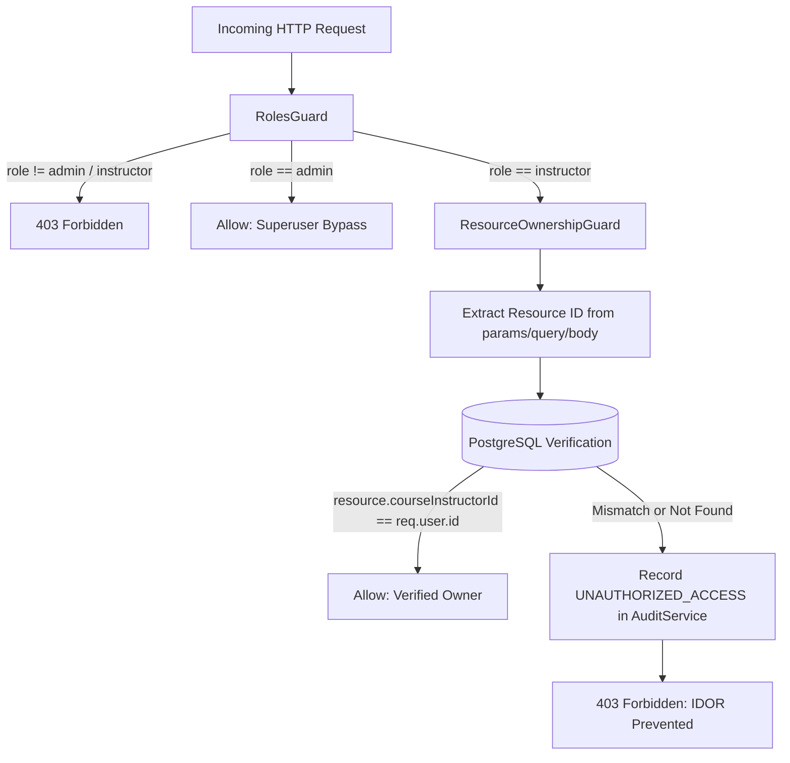
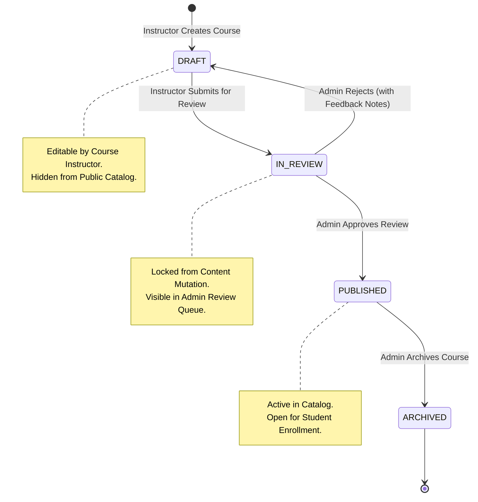
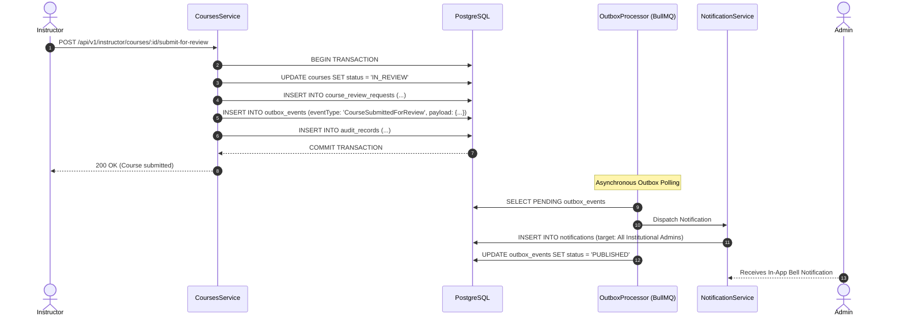

# P6.2 Architecture Review: Security, Data Models, API Design, and Invariants

**Repository:** `RafisGit/Techsprout` (`d:\Work\2026\techsprout-main`)  
**Audit Baseline:** Commit `d67d8eed0ed570e1e347e7952b9ae0cc80fbb38b` on `main`  
**Status:** COMPLETE ARCHITECTURE SPECIFICATION  
**Implementation Status:** NOT AUTHORIZED (Review & Planning Only)

---

## 1. Overview & Architecture Objectives

The primary architectural goal of **Milestone P6.2 (Instructor Platform)** is to decouple educator curriculum authoring and learner tracking from the institutional administrative portal, while preserving the strict zero-trust security and data invariants established across Phases P1–P6.1.

### Core Architectural Principles:
1. **Zero-Trust Ownership Enforcement:** Every write, update, read, and delete operation on instructor-managed resources must verify server-authoritative ownership against the database via `ResourceOwnershipGuard`.
2. **Deterministic Course Review State Machine:** Courses cannot transition from `DRAFT` to `PUBLISHED` directly by instructors. Institutional quality and accreditation require an administrative review gate (`DRAFT` → `IN_REVIEW` → `PUBLISHED` or `DRAFT`).
3. **Preservation of Financial & Catalog Invariants:** Course pricing modifications must not corrupt completed orders, invoice snapshots, or refund calculations.
4. **Additive, Forward-Only Schema Migrations:** All database enhancements must be non-destructive and backward compatible with existing queries.
5. **Event-Driven Asynchronous Notifications:** Lifecycle transitions must leverage the P6.1 Transactional Outbox + BullMQ pipeline without blocking HTTP request threads.

---

## 2. Security & Authorization Architecture

### 2.1 The Existing Zero-Trust Foundation
Phase P6.1 delivered `ResourceOwnershipGuard` ([resource-ownership.guard.ts](file:///d:/Work/2026/techsprout-main/apps/api/src/common/guards/resource-ownership.guard.ts)), which intercepts incoming requests annotated with `@RequireOwnership(resourceType, idParamKey)`.



### 2.2 Hierarchical Resource Resolution Table
The guard verifies ownership across the entire 6-level LMS curriculum hierarchy using strict inner joins:

| Resource Type | Verification Query Path | Authorized Condition |
| :--- | :--- | :--- |
| **`course`** | `SELECT instructorId FROM courses WHERE id = :id` | `course.instructorId === req.user.id` |
| **`module`** | `SELECT courses.instructorId FROM modules JOIN courses ON modules.courseId = courses.id WHERE modules.id = :id` | `courses.instructorId === req.user.id` |
| **`lesson`** | `SELECT courses.instructorId FROM lessons JOIN modules ON lessons.moduleId = modules.id JOIN courses ON modules.courseId = courses.id WHERE lessons.id = :id` | `courses.instructorId === req.user.id` |
| **`quiz`** | `SELECT courses.instructorId FROM quizzes JOIN modules ON quizzes.moduleId = modules.id JOIN courses ON modules.courseId = courses.id WHERE quizzes.id = :id` | `courses.instructorId === req.user.id` |
| **`quizQuestion`** | `SELECT courses.instructorId FROM quizQuestions JOIN quizzes ON ... JOIN modules ON ... JOIN courses ON ... WHERE quizQuestions.id = :id` | `courses.instructorId === req.user.id` |
| **`quizOption`** | `SELECT courses.instructorId FROM quizQuestionOptions JOIN quizQuestions ON ... JOIN quizzes ON ... JOIN modules ON ... JOIN courses ON ... WHERE quizQuestionOptions.id = :id` | `courses.instructorId === req.user.id` |
| **`media`** | `SELECT uploaderId FROM media WHERE id = :id OR storageKey = :id` | `!media.uploaderId \|\| media.uploaderId === req.user.id` |

### 2.3 Critical Invariants for P6.2:
1. **Server-Authoritative Context:** The instructor's user ID is **never** accepted from the request body or query parameter. It is strictly extracted from `req.user.id` (populated by `SessionAuthGuard` via the encrypted `techsprout_session` cookie or bearer token).
2. **Cross-Instructor Isolation:** If Instructor A attempts to update, delete, or add lessons to a course owned by Instructor B, the guard halts execution at line 109 with a `403 FORBIDDEN` and emits an immutable security audit event.
3. **Student Isolation:** Students cannot invoke any `/api/v1/instructor/*` or `/api/v1/admin/*` endpoint. `RolesGuard` rejects students with `403 FORBIDDEN` before database resolution is attempted.
4. **Standardization of Roster Guarding:** Currently, `AdminEnrollmentsController` validates course ownership in `enrollments.service.ts` line 805. For P6.2, we recommend attaching `@UseGuards(RolesGuard, ResourceOwnershipGuard)` and `@RequireOwnership('course', 'id')` directly to `getCourseEnrollments` to make ownership enforcement declarative and consistent with curriculum controllers.

---

## 3. Course Review State Machine & Workflow

### 3.1 Lifecycle States & Allowed Transitions



### 3.2 State Transition Invariant Rules:
1. **Curriculum Completeness Preflight:** An instructor cannot submit a course for review unless:
   - The course has a title, category, description, and thumbnail media.
   - The course contains at least one module with at least one published lesson.
   - Pricing is valid (either `0.00` for free or `>= 100.00 BDT`).
2. **Immutability During Review:** While in `IN_REVIEW` status, course metadata, modules, and lessons cannot be modified or deleted by the instructor. To edit, the instructor must either withdraw the review or wait for admin feedback.
3. **Institutional Administrator Exclusivity:** Only users with `role === 'admin'` can approve or reject reviews, or transition courses to `PUBLISHED` or `ARCHIVED`.

---

## 4. Database Schema Proposals (Drizzle ORM)

All proposed schema modifications are **strictly additive** and require **zero data backfills** for existing tables.

### 4.1 Schema Modification 1: Enum Extension
Update `course_status` enum in PostgreSQL to add `'IN_REVIEW'`:
```sql
ALTER TYPE course_status ADD VALUE 'IN_REVIEW' AFTER 'DRAFT';
```

In `apps/api/src/database/schema/courses.ts`:
```typescript
// Proposed update:
export const courseStatusEnum = pgEnum('course_status', ['DRAFT', 'IN_REVIEW', 'PUBLISHED', 'ARCHIVED']);
```

### 4.2 Schema Modification 2: New Entity `course_review_requests`
Create `apps/api/src/database/schema/course-reviews.ts`:
```typescript
import { pgTable, uuid, varchar, text, timestamp, index, pgEnum } from 'drizzle-orm/pg-core';
import { courses } from './courses';
import { users } from './users';

export const reviewStatusEnum = pgEnum('course_review_status', ['PENDING', 'APPROVED', 'REJECTED', 'WITHDRAWN']);

export const courseReviewRequests = pgTable(
  'course_review_requests',
  {
    id: uuid('id').defaultRandom().primaryKey(),
    courseId: uuid('course_id')
      .references(() => courses.id, { onDelete: 'cascade' })
      .notNull(),
    instructorId: uuid('instructor_id')
      .references(() => users.id, { onDelete: 'restrict' })
      .notNull(),
    status: reviewStatusEnum('status').default('PENDING').notNull(),
    submissionNotes: text('submission_notes'),
    adminFeedback: text('admin_feedback'),
    reviewedBy: uuid('reviewed_by').references(() => users.id, { onDelete: 'set null' }),
    submittedAt: timestamp('submitted_at', { withTimezone: true }).defaultNow().notNull(),
    reviewedAt: timestamp('reviewed_at', { withTimezone: true }),
    updatedAt: timestamp('updated_at', { withTimezone: true }).defaultNow().notNull(),
  },
  (table) => [
    index('course_reviews_course_id_idx').on(table.courseId),
    index('course_reviews_instructor_id_idx').on(table.instructorId),
    index('course_reviews_status_idx').on(table.status),
  ]
);

export type CourseReviewRequest = typeof courseReviewRequests.$inferSelect;
export type NewCourseReviewRequest = typeof courseReviewRequests.$inferInsert;
```

### 4.3 Schema Modification 3: New Entity `instructor_profiles`
Create `apps/api/src/database/schema/instructor-profiles.ts`:
```typescript
import { pgTable, uuid, varchar, text, timestamp, uniqueIndex, index } from 'drizzle-orm/pg-core';
import { users } from './users';
import { media } from './media';

export const instructorProfiles = pgTable(
  'instructor_profiles',
  {
    id: uuid('id').defaultRandom().primaryKey(),
    userId: uuid('user_id')
      .references(() => users.id, { onDelete: 'cascade' })
      .notNull(),
    headline: varchar('headline', { length: 150 }),
    bio: text('bio'),
    credentials: text('credentials'), // e.g., "M.Sc. in Computer Science, 10+ years teaching"
    expertiseAreas: text('expertise_areas'), // JSON array string or comma-delimited
    websiteUrl: varchar('website_url', { length: 255 }),
    linkedinUrl: varchar('linkedin_url', { length: 255 }),
    githubUrl: varchar('github_url', { length: 255 }),
    avatarMediaId: uuid('avatar_media_id').references(() => media.id, { onDelete: 'set null' }),
    createdAt: timestamp('created_at', { withTimezone: true }).defaultNow().notNull(),
    updatedAt: timestamp('updated_at', { withTimezone: true }).defaultNow().notNull(),
  },
  (table) => [
    uniqueIndex('instructor_profiles_user_id_uq').on(table.userId),
    index('instructor_profiles_user_id_idx').on(table.userId),
  ]
);

export type InstructorProfile = typeof instructorProfiles.$inferSelect;
export type NewInstructorProfile = typeof instructorProfiles.$inferInsert;
```

---

## 5. API Design Proposals

### 5.1 Instructor API Endpoints (`/api/v1/instructor/*`)

| Method | Endpoint | Authorization | Description | Status |
| :--- | :--- | :--- | :--- | :--- |
| `GET` | `/api/v1/instructor/dashboard` | `@Roles('instructor')` | Aggregated metrics: assigned courses, draft count, pending reviews, active enrollments. | **New Proposal** |
| `GET` | `/api/v1/instructor/courses` | `@Roles('instructor')` | Lists courses owned by the authenticated instructor with filters (`status`, `search`). | **New Proposal** (wraps `findAdminCourses`) |
| `GET` | `/api/v1/instructor/courses/:id` | `@Roles('instructor')` + `@RequireOwnership('course', 'id')` | Detailed course record with modules, lessons, and review history. | **New Proposal** |
| `POST` | `/api/v1/instructor/courses/:id/submit-for-review` | `@Roles('instructor')` + `@RequireOwnership('course', 'id')` | Submits draft course for admin review; transitions course to `IN_REVIEW`. | **New Proposal** |
| `POST` | `/api/v1/instructor/courses/:id/withdraw-review` | `@Roles('instructor')` + `@RequireOwnership('course', 'id')` | Cancels pending review; reverts course to `DRAFT`. | **New Proposal** |
| `GET` | `/api/v1/instructor/courses/:id/learners` | `@Roles('instructor')` + `@RequireOwnership('course', 'id')` | Paginated roster of enrolled students with progress and completion dates. | **New Proposal** (delegates to `EnrollmentsService`) |
| `GET` | `/api/v1/instructor/profile` | `@Roles('instructor')` | Fetches authenticated instructor's professional profile. | **New Proposal** |
| `PATCH` | `/api/v1/instructor/profile` | `@Roles('instructor')` | Updates authenticated instructor's professional profile. | **New Proposal** |

### 5.2 Administrator Review Queue Endpoints (`/api/v1/admin/courses/*`)

| Method | Endpoint | Authorization | Description | Status |
| :--- | :--- | :--- | :--- | :--- |
| `GET` | `/api/v1/admin/courses/review-queue` | `@Roles('admin')` | Lists all courses currently in `IN_REVIEW` status with submission notes. | **New Proposal** |
| `POST` | `/api/v1/admin/courses/:id/approve-review` | `@Roles('admin')` | Approves review; sets course status to `PUBLISHED`, updates review request to `APPROVED`. | **New Proposal** |
| `POST` | `/api/v1/admin/courses/:id/reject-review` | `@Roles('admin')` | Rejects review; requires `adminFeedback` body; sets course status to `DRAFT`. | **New Proposal** |

---

## 6. Event Outbox & BullMQ Integration

To maintain loose coupling and ensure transactional integrity, all lifecycle notifications are routed through the P6.1 Transactional Outbox pattern:



### New Event Types for P6.2:
1. `CourseSubmittedForReview`:
   - Entity: `course`
   - Actor: Instructor User ID
   - Recipients: All users with `role === 'admin'`
   - Title: *"Course Submitted for Review: {courseTitle}"*
   - Message: *"Instructor {instructorName} submitted a course for publication review."*
   - Action URL: `/admin/courses/{courseId}`
2. `CourseReviewApproved`:
   - Entity: `course`
   - Actor: Admin User ID
   - Recipient: Course Instructor
   - Title: *"Course Approved & Published!"*
   - Message: *"Your course '{courseTitle}' has been approved and is now live in the catalog."*
   - Action URL: `/instructor/courses/{courseId}`
3. `CourseReviewRejected`:
   - Entity: `course`
   - Actor: Admin User ID
   - Recipient: Course Instructor
   - Title: *"Course Review Feedback Available"*
   - Message: *"Your course '{courseTitle}' requires updates before publication. Feedback: {adminFeedback}"*
   - Action URL: `/instructor/courses/{courseId}`

---

## 7. Data and Financial Invariants Preservation

### 7.1 Financial Invariants:
1. **Server-Authoritative Pricing:** Course pricing is recorded in BDT with precision `10, 2` and minor unit representation in orders.
2. **Post-Enrollment Price Modifications:** Once a course has active paid enrollments (`orders.status === 'PAID'`), instructors cannot arbitrarily alter pricing without creating a distinct new course or receiving administrative approval.
3. **No Revenue Logic in P6.2:** Instructor payout, revenue splitting, and commission calculations are **strictly deferred to Phase P7**. P6.2 does not touch the SSLCommerz payment engine, invoice generation, or refund processing.

### 7.2 Database Migration Invariants:
- All Drizzle migrations must be forward-only.
- No `DROP TABLE` or destructive `ALTER TABLE` commands.
- Foreign keys must preserve referential integrity (`onDelete: 'restrict'` on users and categories; `onDelete: 'cascade'` only on tightly coupled children like modules and lessons).

---

## 8. Summary & Next Steps

This architecture delivers a complete, secure, and decoupled foundation for the P6.2 Instructor Platform. It reuses existing, audited mechanisms (`ResourceOwnershipGuard`, `OutboxService`, `AuditService`) and introduces no foreign frameworks or unnecessary dependencies.
