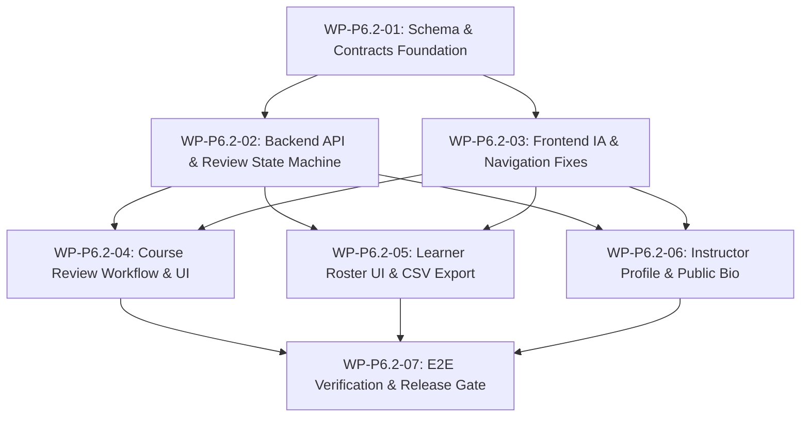

# P6.2 Implementation Plan, Work Packages, Risk Register & Decision Log

**Project:** TechSprout School LMS  
**Phase:** P6.2 — Instructor Platform  
**Audit Baseline:** Commit `d67d8eed0ed570e1e347e7952b9ae0cc80fbb38b` on `main`  
**Status:** IMPLEMENTATION-READY SPECIFICATION  
**Implementation Status:** NOT AUTHORIZED (Planning & Review Only)

---

## 1. Work Package Breakdown & Sequencing

To ensure high engineering velocity with zero regression risk, P6.2 is organized into **seven atomic, reviewable work packages (WPs)**. Each package represents a standalone increment that can be reviewed, merged, and validated independently.

### Dependency Graph & Implementation Sequence:

---

## 2. Work Package Details

### WP-P6.2-01: Database Schema & Contracts Foundation
- **User Value:** Establishes the relational data model for course reviews and instructor profiles without modifying existing tables destructively.
- **Scope:** Drizzle ORM schema definitions, additive forward migration, and shared contract DTOs.
- **Dependencies:** None (builds on P6.1 database baseline).
- **Backend Work:**
  - Update `courseStatusEnum` in `courses.ts` to include `'IN_REVIEW'`.
  - Create `course-reviews.ts` (`course_review_requests` table).
  - Create `instructor-profiles.ts` (`instructor_profiles` table).
  - Generate Drizzle migration (`0008_instructor_platform_foundation.sql`).
- **Database/API Contract Work:** Update `packages/contracts` with review request and instructor profile Zod schemas and TypeScript interfaces.
- **Testing & Security:** Migration test in in-memory PostgreSQL (`pg-mem`); verify existing catalog tests pass without schema friction.
- **Estimated Effort:** 4–6 engineer-hours (0.5 – 0.75 engineer-days).
- **Main Risk:** PostgreSQL enum alteration on managed cloud instances (Render). *Mitigation: Verified safe via standard additive `ALTER TYPE ... ADD VALUE`.*

---

### WP-P6.2-02: Backend Instructor Core API & Review State Machine
- **User Goal:** Provide secure, server-authoritative endpoints for instructor dashboard metrics, review submission, review approval/rejection, and profile management.
- **Dependencies:** WP-P6.2-01.
- **Backend Work:**
  - Create `InstructorCoursesController` under `/api/v1/instructor/courses` using `@Roles('instructor')` and `ResourceOwnershipGuard`.
  - Implement `submitForReview` preflight validator and transition in `CoursesService`.
  - Implement `approveReview` and `rejectReview` methods with admin-only guards in `CoursesController`.
  - Wire Outbox events: `CourseSubmittedForReview`, `CourseReviewApproved`, `CourseReviewRejected`.
  - Add security audit records for all review actions.
- **Testing & Security:** Add unit tests for preflight validation; write 15+ API integration tests verifying IDOR protection and cross-instructor isolation.
- **Estimated Effort:** 8–12 engineer-hours (1.0 – 1.5 engineer-days).
- **Completion Evidence:** `vitest run src/test/instructor-security.spec.ts` passes with 100% green assertions.

---

### WP-P6.2-03: Frontend Information Architecture & Navigation Fixes
- **User Value:** Resolves the alarming 403 Forbidden navigation leak on the overview tab and provides instructors with a dedicated navigation shell.
- **Dependencies:** None (can proceed in parallel with WP-P6.2-01/02).
- **Frontend Work:**
  - Update `Header.tsx` to conditionally render "Instructor Portal" (`/instructor/dashboard`) for instructors and "Admin Portal" for admins.
  - Fix `AdminNav.tsx`: hide the Overview tab from non-admins (`show: isAdmin`).
  - Create `apps/web/src/app/instructor/layout.tsx` with role checking.
  - Create `InstructorNav.tsx` with tabs: `Dashboard`, `My Courses`, `Profile`.
  - Build skeleton pages for `/instructor/dashboard` and `/instructor/courses`.
- **Testing & Security:** Add Vitest component tests verifying navigation links and role-based visibility.
- **Estimated Effort:** 6–8 engineer-hours (0.75 – 1.0 engineer-days).
- **Completion Evidence:** Logged-in instructor sees clear navigation without any 403 errors when clicking tabs.

---

### WP-P6.2-04: Course Review Workflow & Interactive Submission UI
- **User Value:** Replaces the static dead notice in `PublishingActions.tsx` with an interactive, institutional course review workflow.
- **Dependencies:** WP-P6.2-02, WP-P6.2-03.
- **Frontend Work:**
  - Build `CourseReviewModal.tsx` showing checklist verification (modules, lessons, pricing, thumbnail) and submission notes.
  - Integrate submission button on `/instructor/courses/[id]`.
  - Display review status badge, submission timestamp, and admin feedback alert banner if revisions are requested.
  - Update `/admin/courses` with an "In Review" filter tab and review decision modal (Approve / Request Revisions).
- **Testing & Security:** Test modal form submission, optimistic TanStack Query updates, and validation error handling.
- **Estimated Effort:** 8–10 engineer-hours (1.0 – 1.25 engineer-days).
- **Completion Evidence:** Instructor can submit draft course; admin can approve or reject with notes; status updates in real time.

---

### WP-P6.2-05: Learner Roster & Progress Tracking UI
- **User Value:** Enables educators to see which students are enrolled in their courses, track student completion rates, and export attendance records.
- **Dependencies:** WP-P6.2-02, WP-P6.2-03.
- **Frontend Work:**
  - Build `/instructor/courses/[id]/learners/page.tsx`.
  - Create `LearnerRosterTable.tsx` with columns: Student Name, Email, Enrolled Date, Status, Progress Bar (`%`), and Certificate Status.
  - Add search filter and enrollment status filter tabs.
  - Implement client-side CSV export functionality formatting roster data as RFC-4180 CSV.
  - Empty state: *"No students enrolled yet."*
- **Testing & Security:** Vitest component tests for table filtering, pagination, and CSV generation.
- **Estimated Effort:** 6–8 engineer-hours (0.75 – 1.0 engineer-days).
- **Completion Evidence:** Roster loads correctly for owned course; access denied for unowned course; CSV downloads with accurate headers.

---

### WP-P6.2-06: Instructor Profile Management & Catalog Bio
- **User Value:** Educators can establish credibility and personal branding; students can evaluate instructor qualifications before purchasing.
- **Dependencies:** WP-P6.2-01, WP-P6.2-02, WP-P6.2-03.
- **Frontend Work:**
  - Build `/instructor/profile/page.tsx` with React Hook Form + Zod validation.
  - Form fields: Headline, Bio (Markdown preview), Academic Credentials, LinkedIn, GitHub, Website URL.
  - Reuse `MediaUploader` for instructor avatar photo.
  - Update public course details page (`/courses/[slug]`) to render the instructor profile card in the "About the Instructor" section.
- **Testing & Security:** Test profile update mutation and validation error states.
- **Estimated Effort:** 6–8 engineer-hours (0.75 – 1.0 engineer-days).
- **Completion Evidence:** Instructor updates bio and photo; changes appear immediately on public course catalog pages.

---

### WP-P6.2-07: End-to-End Verification & Release Gate
- **User Value:** Guarantees zero regressions across P1–P6.1 and proves P6.2 release safety on staging infrastructure.
- **Dependencies:** WP-P6.2-01 through WP-P6.2-06.
- **Testing & Safety Work:**
  - Run full automated test suite: `pnpm test` (verify ≥ 1,235 passing tests).
  - Run linter and typechecker: `pnpm lint`, `pnpm typecheck`.
  - Execute full production builds: `pnpm build`.
  - Deploy to dedicated staging environment (`Render` + `Vercel`).
  - Execute live staging smoke test checklist (instructor login, course authoring, review submission, admin approval, learner roster viewing).
  - Sentry exception monitoring audit.
- **Documentation:** Produce `docs/qa/p6.2-staging-verification-and-release-gate.md`.
- **Estimated Effort:** 6–8 engineer-hours (0.75 – 1.0 engineer-days).
- **Completion Evidence:** Staging sign-off report with passing test logs and verified live URLs.

---

## 3. Overall Effort Estimate Summary

| Work Package | Title | Estimated Hours | Estimated Days (8h/day) |
| :--- | :--- | :--- | :--- |
| **WP-P6.2-01** | Schema & Contracts Foundation | 4 – 6 h | 0.5 – 0.75 d |
| **WP-P6.2-02** | Backend API & Review State Machine | 8 – 12 h | 1.0 – 1.5 d |
| **WP-P6.2-03** | Frontend IA & Navigation Fixes | 6 – 8 h | 0.75 – 1.0 d |
| **WP-P6.2-04** | Course Review Workflow & UI | 8 – 10 h | 1.0 – 1.25 d |
| **WP-P6.2-05** | Learner Roster UI & CSV Export | 6 – 8 h | 0.75 – 1.0 d |
| **WP-P6.2-06** | Instructor Profile & Catalog Bio | 6 – 8 h | 0.75 – 1.0 d |
| **WP-P6.2-07** | E2E Verification & Release Gate | 6 – 8 h | 0.75 – 1.0 d |
| **TOTAL** | **Milestone P6.2 Full Delivery** | **44 – 60 engineer-hours** | **5.5 – 7.5 engineer-days** |

*Assumption:* Single full-stack senior engineer executing sequentially, or two engineers working across API and Web in parallel (compressing timeline to ~3.5 calendar days).

---

## 4. Risk Register

| Risk ID | Description | Severity | Likelihood | Impact | Mitigation Strategy | Owner WP |
| :--- | :--- | :--- | :--- | :--- | :--- | :--- |
| **RSK-P6.2-01** | Horizontal Privilege Escalation (IDOR) across instructors accessing draft courses or rosters. | **HIGH** | Medium | Critical | Enforce `ResourceOwnershipGuard` on all `/api/v1/instructor/*` routes; derive user identity strictly from `req.user.id`; comprehensive negative test suite. | WP-02 |
| **RSK-P6.2-02** | Course mutated by instructor while institutional admin is reviewing curriculum. | **MEDIUM** | Medium | Moderate | State machine immutability lock: reject all curriculum updates when `status === 'IN_REVIEW'`. | WP-02, WP-04 |
| **RSK-P6.2-03** | Frontend navigation leak leading to 403 Forbidden errors for educators. | **MEDIUM** | High | Low | Create isolated `InstructorNav` component; conditionally render overview link in `AdminNav` based on `isAdmin`. | WP-03 |
| **RSK-P6.2-04** | Performance degradation on large course rosters (>5,000 enrolled students). | **LOW** | Low | Moderate | Database query enforces indexed pagination (`limit` default 20, max 100); stream CSV generation. | WP-05 |
| **RSK-P6.2-05** | Regressions in existing P1–P6.1 catalog, checkout, or quiz flows. | **HIGH** | Low | Critical | Additive-only schema design; mandatory pass of all 1,195 existing automated regression tests prior to release. | WP-01, WP-07 |

---

## 5. Decision Log

| Decision ID | Context & Options Considered | Decision Made | Rationale |
| :--- | :--- | :--- | :--- |
| **DEC-P6.2-01** | Route Structure: Place instructor pages under `/admin/instructor/*` vs. `/dashboard/instructor/*` vs. `/instructor/*`. | **Adopt `/instructor/*`** | Clean separation of concerns; prevents role confusion; eliminates nested layout inheritance issues from `/admin/layout.tsx`. |
| **DEC-P6.2-02** | Course Publishing Model: Open Self-Publishing (Udemy model) vs. Administrative Review Gate (Coursera/Institutional model). | **Institutional Review Gate (`IN_REVIEW`)** | TechSprout is an institutional LMS with accredited certificate issuance. Preserves curriculum quality and fulfills static promise in `PublishingActions.tsx`. |
| **DEC-P6.2-03** | Course Ownership Cardinality: Single Instructor (`courses.instructor_id`) vs. Multi-Instructor Join Table (`course_instructors`). | **Preserve Single Instructor for P6.2; Defer Multi-Instructor to P7** | Current schema and `ResourceOwnershipGuard` are optimized for single ownership. Multi-tenancy adds significant complexity with minimal immediate user need. |
| **DEC-P6.2-04** | Analytics Scope: Include drop-off graphs in P6.2 vs. Defer to P6.3. | **Defer Advanced Analytics to P6.3; Provide Student Roster in P6.2** | Preserves roadmap boundaries. P6.2 focuses on curriculum authoring and basic roster tracking; P6.3 delivers dedicated learning analytics. |
| **DEC-P6.2-05** | Notification Integration: Synchronous in-memory alerts vs. P6.1 Transactional Outbox + BullMQ. | **P6.1 Outbox + BullMQ Engine** | Reuses tested P6.1 infrastructure; guarantees notification durability without blocking HTTP request threads. |

---

## 6. Evidence Register

| Claim / Conclusion | Repository Source File | Lines / Test Evidence |
| :--- | :--- | :--- |
| Zero-Trust Resource Guard exists and enforces ownership | `apps/api/src/common/guards/resource-ownership.guard.ts` | Lines 30–235 (Course, Module, Lesson, Quiz, Option, Media checks) |
| Authoritative Instructor ID assignment on creation | `apps/api/src/modules/courses/courses.service.ts` | Line 70 (`instructorId = user.role === 'admin' ? ... : user.id`) |
| AdminNav Overview links to admin-only page causing 403 | `apps/web/src/components/admin/AdminNav.tsx` & `page.tsx` | AdminNav.tsx L18 vs. overview/page.tsx L9–15 |
| Static course publishing notice promises review workflow | `apps/web/src/components/admin/PublishingActions.tsx` | Lines 172–176 |
| Course status enum currently limited to DRAFT, PUBLISHED, ARCHIVED | `apps/api/src/database/schema/courses.ts` | Line 17 (`courseStatusEnum`) |
| Roster endpoint implemented on backend with ownership check | `apps/api/src/modules/enrollments/admin-enrollments.controller.ts` & `enrollments.service.ts` | Controller L81–116; Service L794–820 |
| Automated test baseline passing | `apps/api` test runner & `apps/web` test runner | 935 API tests passing + 260 Web tests passing = 1,195 passing tests |
| Production deployment of P6.1 verified | `docs/qa/p6.1-production-deployment-and-post-deployment-verification.md` | Commit `d67d8ee` verified on live staging & production |
