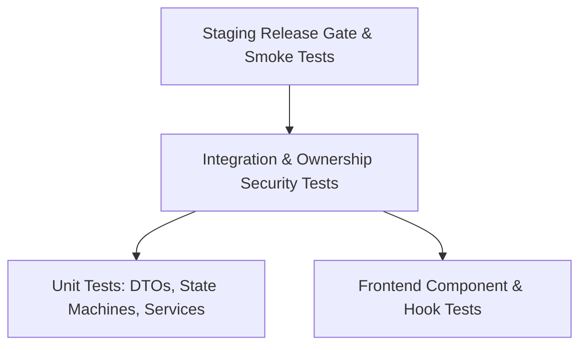

# P6.2 Test Strategy & Release Safety Gate Specification

**Project:** TechSprout School LMS  
**Phase:** P6.2 — Instructor Platform  
**Audit Baseline:** Commit `d67d8eed0ed570e1e347e7952b9ae0cc80fbb38b` on `main`  
**Current Test Baseline:** 1,195 passing automated tests (935 API, 260 Web)  
**Status:** COMPLETE TEST & SAFETY SPECIFICATION  
**Implementation Status:** NOT AUTHORIZED (Planning & Review Only)

---

## 1. Quality Objectives & Invariant Safeguards

The implementation of Phase P6.2 must guarantee that the established stability, financial accuracy, and security posture of TechSprout are strictly preserved.

### Core Testing Mandates:
1. **Zero Regression Tolerance:** All 1,195 existing tests must continue to pass cleanly without modification to historical test logic.
2. **Exhaustive IDOR & Ownership Verification:** Every newly introduced or updated endpoint must be proven immune to horizontal privilege escalation across instructors.
3. **Deterministic State Machine Validation:** The course review lifecycle (`DRAFT` → `IN_REVIEW` → `PUBLISHED` / `DRAFT`) must be tested against all edge cases, illegal transitions, and incomplete submissions.
4. **Environment Isolation Compliance:** Staging and CI test runs must execute against isolated test databases (`pg-mem` / local PostgreSQL) and never mutate live production databases or third-party storage.

---

## 2. Test Pyramid & Coverage Architecture

### 2.1 Backend Unit Test Suite (`apps/api`)
- **Review Preflight Validator:** Unit tests ensuring `canSubmitForReview(courseId)` fails if:
  - Modules count == 0.
  - Published lessons count == 0.
  - Missing course thumbnail or short description.
  - Price is negative or improperly formatted.
- **DTO Validation Tests:** Zod schema validation tests for:
  - `submitCourseReviewSchema`
  - `reviewDecisionSchema` (requires non-empty feedback string if `status === 'REJECTED'`)
  - `updateInstructorProfileSchema` (URL validation for LinkedIn/GitHub, length checks)

### 2.2 Authorization & Security Test Suite (`apps/api/test/instructor-security.spec.ts`)
A dedicated security suite must verify the following matrix:

| Security Scenario | Actor Context | Target Resource | Expected HTTP Code | Expected Error Code / Action |
| :--- | :--- | :--- | :--- | :--- |
| **Anonymous Access** | Unauthenticated | `/api/v1/instructor/*` | `401 Unauthorized` | `UNAUTHENTICATED` |
| **Student Access** | Role `student` | `/api/v1/instructor/*` | `403 Forbidden` | `FORBIDDEN` |
| **Cross-Instructor Course Edit** | Instructor A | Course owned by Instructor B | `403 Forbidden` | `FORBIDDEN` + Audit Log `UNAUTHORIZED_ACCESS` |
| **Cross-Instructor Module Injection** | Instructor A | Course owned by Instructor B | `403 Forbidden` | `FORBIDDEN` (Nested check in `ResourceOwnershipGuard`) |
| **Cross-Instructor Roster Snooping** | Instructor A | Course owned by Instructor B | `403 Forbidden` | `NOT_COURSE_OWNER` |
| **Instructor Self-Publish Attempt** | Instructor A | `/admin/courses/:id/publish` | `403 Forbidden` | `FORBIDDEN` (Admin role required) |
| **Admin Superuser Access** | Role `admin` | Any course / roster | `200 OK` | Allowed via superuser bypass |

### 2.3 Course Review State Machine Integration Tests (`apps/api/test/course-review-lifecycle.spec.ts`)
- **Full Lifecycle Flow:**
  1. Instructor creates course (initial status `DRAFT`).
  2. Instructor adds module and lesson.
  3. Instructor submits for review (transitions to `IN_REVIEW`, inserts `course_review_requests`, emits `CourseSubmittedForReview` outbox event).
  4. Instructor attempts to edit course during review (fails with `400 BAD_REQUEST: COURSE_LOCKED_FOR_REVIEW`).
  5. Admin reviews and rejects with notes (transitions back to `DRAFT`, emits `CourseReviewRejected`).
  6. Instructor edits course and resubmits.
  7. Admin approves (transitions to `PUBLISHED`, sets `publishedAt`, emits `CourseReviewApproved`).
- **Concurrent Review Protection:** Verify unique constraint prevents duplicate pending review requests for the same course.

### 2.4 Frontend Component & Workflow Tests (`apps/web/src/__tests__`)
- **`instructor-navigation.spec.ts`:**
  - Verifies `InstructorNav` renders correct links.
  - Verifies role-based header link renders "Instructor Portal" for instructors and "Admin Portal" for admins.
  - Verifies instructors are never presented with a link to `/dashboard/admin/overview`.
- **`instructor-roster.spec.ts`:**
  - Tests `LearnerRosterTable` pagination, search filtering, and progress bar rendering.
  - Tests empty state rendering when zero enrollments exist.
  - Tests CSV export button payload structure.
- **`course-review-modal.spec.ts`:**
  - Tests checklist validation before enabling the submit button.
  - Tests submission mutation and success toast.

---

## 3. Regression Protection for Phases P1–P6.1

To prevent side-effects in previously verified subsystems, the test suite must execute existing regression tests before any release approval:

| Subsystem | Existing Test File | Protected Invariant |
| :--- | :--- | :--- |
| **P1 Catalog Foundation** | `src/test/catalog-database.spec.ts`, `public-catalog.spec.ts` | Slug uniqueness, category foreign keys, price formatting. |
| **P2 Auth & RBAC** | `src/test/auth-database.spec.ts`, `security.spec.ts` | Session tokens, password hashing, role guards. |
| **P3 Payment & Orders** | `src/test/payment-database.spec.ts`, `checkout-flow.spec.ts` | SSLCommerz verification, BDT minor units, order state machine. |
| **P4 Quizzes & Certificates** | `src/test/quiz-certificate-database.spec.ts`, `quiz-learning.spec.ts` | Frozen certificate snapshots, quiz attempts integrity. |
| **P5 Refunds & Finance** | `src/test/refund-database.spec.ts`, `student-refunds.spec.ts` | Full refund policy, certificate revocation on refund. |
| **P6.1 Notifications & Outbox** | `src/test/notifications.spec.ts`, `resource-ownership-guard.spec.ts` | Outbox polling, BullMQ delivery, IDOR protection. |

---

## 4. Staging Smoke Test Plan & Release Gate Criteria

Before P6.2 can be promoted from development to staging, and subsequently to production, it must satisfy the following strict release gates:

### Gate 1: Build & Static Analysis Gate
- `pnpm typecheck` must pass with 0 errors across all workspaces (`api`, `web`, `contracts`).
- `pnpm lint` must pass with 0 warnings or errors.
- `pnpm build` must succeed with clean production bundles.

### Gate 2: Automated Test Gate
- All existing 1,195 tests must pass.
- At least 40 new automated tests must be added covering P6.2 features (projected total: ≥ 1,235 passing tests).

### Gate 3: Staging Deployment Smoke Test
On the isolated staging environment (`techsprout-api-staging.onrender.com` & `techsprout-web-staging.vercel.app`):
1. Log in as seeded instructor Dr. Sarah Mitchell (`instructor@techsprout.edu`).
2. Verify Header displays "Instructor Portal" and navigates to `/instructor/dashboard`.
3. Verify `/instructor/dashboard` loads summary metrics without 403 errors.
4. Create a draft course, add a module, and add a lesson.
5. Submit the course for administrative review. Verify course status transitions to `IN_REVIEW`.
6. Log in as institutional administrator (`admin@techsprout.edu`).
7. Inspect `/admin/courses`, filter by `In Review`, and approve the course.
8. Verify course appears as `PUBLISHED` in public catalog (`/courses`).
9. Verify student enrollment roster loads on `/instructor/courses/[id]/learners`.
10. Download CSV roster and verify format.
11. Verify Sentry records 0 new unhandled exceptions.

---

## 5. Rollback & Contingency Plan

If any critical defect is detected during staging or production deployment:
1. **API Rollback:** Fast rollback via Render dashboard or Git commit revert. Because all database migrations are strictly additive (new tables and enum value addition), rolling back application code will not corrupt the database schema.
2. **Frontend Rollback:** Immediate instant rollback to previous deployment hash via Vercel dashboard.
3. **Data Safety:** No historical records, enrollments, orders, or certificates will be modified by P6.2, guaranteeing zero data loss during any rollback.
